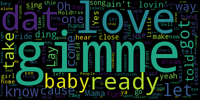

# TAL - Text Analysis of Lyrics

TAL gets Billboard chart information and creates visual output of lyrics. The project is made as a school assignment
for the course *Applied programming for Linguists* at *Stockholm University*.

## Getting Started

These instructions will get you a copy of the project up and running on your local machine.

### Prerequisites

* Python 3
* billboard
* requests
* BeautifulSoup from bs4
* matplotlib.pyplot
* WordCloud from wordcloud

### Installing

If you have git installed, type this command into your terminal:

```
git clone https://github.com/SickanEkman/billboard_project_2
```

If you don't have git, simply download zip files.

## Built With

* [Python 3](https://docs.python.org/3/) - TAL is written in Python 3
* [billboard](https://github.com/guoguo12/billboard-charts) - Python API for accessing music charts from Billboard.com
* [requests](http://docs.python-requests.org/en/latest/index.html) - A HTTP library for Python
* [BeautifulSoup](https://www.crummy.com/software/BeautifulSoup/) - Python library for projects like screen-scraping
* [matplotlib](https://matplotlib.org/) - A Python 2D plotting library
* [wordcloud](https://github.com/amueller/word_cloud) - A little word cloud generator in Python

## Running the program

TAL will ask for all input it needs to run. Just follow the instructions!

### Example

```
> python3 main.py

MENU:
Hit 'd' for new project with default parameters
Hit 'n' for new project with parameters specified by you
Hit 'q' to exit

> n

First year: > 1990
Last year: > 2017
Chart name: > hot-100
Number of songs for each year: > 10

```
(Above selection might take a couple of minutes)
```

Take a look at the json-file created in the project folder. Happy with the song selection?
MENU:
Hit 's' to create a word cloud for each SONG
Hit 'y' to create a word cloud for each YEAR
Hit 'b' to start over from the beginning
Hit 'q' to exit

> y

Word clouds created - take a look in your project folder!

MENU:
Hit 'd' for new project with default parameters
Hit 'n' for new project with parameters specified by you
Hit 'q' to exit

> q

Goodbye!

```



### Features

class Project(*first_year=2010, last_year=this_year, chart="radio-songs", num_songs=3*)

| Parameters    |                                           |
|---------------|-------------------------------------------|
|first_year: int|The year you wish to start getting billbord charts for|
|last_year: int |The last year of your time period. Defaults to current year|
|chart: str     |Example "radio-hits", "hot-100", see [billboard.com](http://www.billboard.com/charts) for more
examples|
|num_songs: int  |Number of songs you wish to get from each year|

| Methods       |                                           |
|---------------|-------------------------------------------|
|get_clouds(cloud_type=...)   |Creates word clouds and save each one as png-file|
|...cloud_type="song"|Creates one word cloud for each song|
|...cloud_type="year"|Creates one word cloud for each year during time span, combining all song lyrics for the year.|

## Authors

[**SickanEkman**](https://github.com/SickanEkman)

## License

This project is licensed under the [MIT License](https://opensource.org/licenses/MIT) - see the [LICENSE.md](LICENSE.md) file for details

## Acknowledgments

* [README inspiration](https://gist.github.com/PurpleBooth/109311bb0361f32d87a2#file-readme-template-md) from [PurpleBooth](https://github.com/PurpleBooth)
* Special thanks to [Shortlisted](https://github.com/shortlisted)
